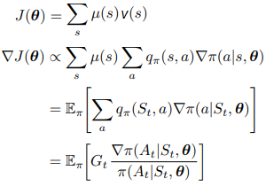
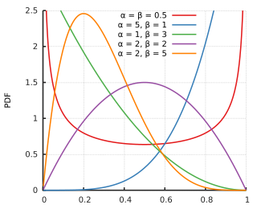
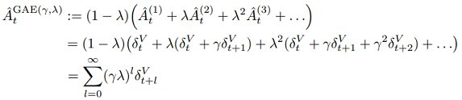

# Learning Reinforcement Learning via Car Racing
## Background
The purpose of this project was to become familiar with reinforcement learning libraries, algorithms and hyperparameter tuning. To accomplish this I hand coded the Double Deep Q Learning and Proximal Policy Approximation algorithms for OpenAI Gym's Car Racing Environment [[1]](https://www.gymlibrary.ml/environments/box2d/car_racing/)). While exploring, I gave myself a research question to avoid simply copying other's implementations. That is, can I obtain high results at a significantly lower computational cost than others?
## Related Works
Below are some of the top implementations from OpenAI Gym's official leaderboard [[2]](https://github.com/openai/gym/wiki/Leaderboard)).

| Model                                 | Training Episodes | 100-Episode Average Score | Write-up |                                                                                                                           
|---------------------------------------|-----------------------|---------------------------|----------------------------------------------------------------------------------------------------------------------------------------|
| PPO |≈10,000 (5*106 environment steps)| 913 | [writeup](https://arxiv.org/abs/2111.02202) |
| DDQN | 900                 | 907 | [writeup](https://github.com/AMD-RIPS/RL-2018/blob/master/documents/leaderboard/IPAM-AMD-Car_Racing.ipynb) |
| World Models | 10,000+ | 906  | [writeup](https://worldmodels.github.io) | 
| PPO | 2760 |820 (*actual) | [writeup](https://github.com/Rafael1s/Deep-Reinforcement-Learning-Udacity/tree/master/CarRacing-From-Pixels-PPO) | 
| Weight Agnostic Neural Networks | N/A | 893  | [writeup](https://weightagnostic.github.io) | 
| PPO | ≈3000 (1.6*106 environment steps) | 905  | [writeup](https://github.com/jperod/AI-self-driving-race-car-Deep-Reinforcement-Learning/blob/master/SI_Final_Project.pdf) | 
| PPO | 5000 | 909 | [writeup](https://github.com/JinayJain/deep-racing) |

Poorer performing implementations include PPO, DQN, AC3 models done by Stanford Students which never surpassed a score of 600 [[3]](https://pdfcoffee.com/reinforcement-car-racing-with-a3c-pdf-free.html), and a DQN fully connected network that achieved a score of 350 [[4]](https://gist.github.com/lmclupr/b35c89b2f8f81b443166e88b787b03ab#file-race-car-cv2-nn-network-td0-15-possible-actions-ipynb).
## Theory
All reinforcement learning algorithms center around a value estimation of a particular configuration. That is, how much discounted reward can I expect starting off from a particular state V(s), state-action pair Q(s,a), or state distribution J(θ) given a particular policy. These can be estimated in many ways, from one extreme of complete Monte-Carlo rollouts (zero bias, high variance), to the other of one-step bootstrap updates. That is with only information on the difference between adjacent and terminal nodes, there should be only 1 true value graph that we can reconstruct. Optimal actions are chosen by simply selecting the highest next configuration, or by directly modifying an action policy function.
### Double Deep Q Networks
Q-learning estimates the value of state-action pairs Q(s,a) using one-step updates. A defining feature of Q-learning is that our agent can learn off policy. That is, it can explore suboptimal actions, while still updating our Q(s,a) knowledgebase so that its consistent with the optimal action policy. This is possible because our free to choose sampled Q(s,a) pairs are bootstrapped off the optimal ensuing Q(s',a) pair (see figure ?), regardless of our agents actual trajectory. Memory is stored in action replay buffers, with experiences being randomly selected at training time to reduce inter correlations between data increasing training stability.

Figure 1: Visualization of Q-update (* denotes optimal actions).
&nbsp;

Deep Q Networks we use a neural network to predict the Q(s,a) value of encountered states. Training minimizes the loss between our predicted Q(s,a) and what its theoretical value if bootsrapped off its descendant (! diagram of training update). Double Deep Q Networks stabilize training by allowing the target R + γQ(s',a) to be predicted by an alternative nearly identical network. This avoids immidiate chasing of moving targets where updating the policy network does not immidiately shift the target and allows loss to temporarily converge. The frequency to which to update the target network is a hyperparameter to tune.

### Proximal Policy Optimization
Policy Gradient methods sample actions according to a probability distribution. The parameters of the probability distribution can be output by a neural network. Our objective is to maximize the value of the policy J(θ), which is the expected discounted reward from starting off in a state distribution given that policy. To update the policy we need the gradients, which is shown in figure 2. All this equation states is that the gradient of the policy's value to its parameters, is proportional to a weighted mean of the gradient of the policy's actions probabilities. These action probabilities are weighted according to Q(s,a) (J(θ) is more sensitive to high valued actions), and μ(s) (the distribution frequency of encountered states for that policy). Notice that it seems that increasing the probabiity of all actions is the correct solution. In reality, the 𝜋(a|s) probabilities for a state must add to one, so the Q(s,a) weighting factor will naturally increase and decrease the appropriate probabilites. When training, we do not explicity calculate μ(s), rather we assume that our sampled experiences will naturally follow the state distribution μ(s) in expectation. We also only sample a particular action per state visit instead of the summation, and we introduce the denominator to reweigh disproportionally sampled actions. Finally, we can replace Q(s,a) with real sampled reward returns Gt.

Proximal Policy Optimization is a type of actor-critic twist on the policy gradient theory. The actor network outputs parameters of the action policy as discussed above. The critic network outputs its value estimation of states which is used in updating. Looking at our policy loss we can see that we subtracted our critic's value estimation from our exprienced return Gt. This stabilizes updates by standardizing the feedback signal (it can be shown that subtracting a baseline does not affect the gradient proportionality). Inuitively, if Gt-V(s) is positive, we experienced more reward than expected, so we increase the probability of recent actions and vice versa (Gt-V(s) can be replaced with more complex advantage functions). The critic network gets updated by the critic loss. Often the actor and critic share layers, so the terms are combined. The entropy of the policy distribution is added to discourage it from collapsing and encourage exploration. Finally we increase stability by wrapping the policy loss with the CLIP function which bounds the magnitude of single updates. The original PPO paper can be found here [[2]](https://arxiv.org/pdf/1707.06347.pdf).

## Data Processing
First, we greyscale and clip regions of the input that have low correlations to performance or are overly complex. This increases training efficiency by focusing more compute on key areas. Second, we extract speed information by summing the pixels of the speed bar and normalizing. Extracting speed this way is more computationally efficient that passing stacked consecutive frames to the CNN as done by others. However information is lost since speed magnitude precision is limited by image resolution.
|                      | Raw Data                    | Processed                     |
|----------------------|-----------------------------|-------------------------------|
| Image Simplification |   &nbsp; &nbsp; &nbsp; (96,96,3) |   &nbsp; &nbsp; &nbsp; (84,96,1) |
| Speed Extraction     |    |speed magnitude ∈ {0,1,2,3,4,5} |

We also limited the quantity of poor training data by terminating episodes once a 0.1 second interval is spent on the grass and return a -100 reward.

## Methods
### Double Deep Q Networks
#### Setup
We reduced the action space by deterministically controlling speed (agent need only control direction). We started with these simplified controls to first test the relationship's learnability.

|          | Steering Angle | Throttle                                        | Brake   |
|----------|----------------|-------------------------------------------------|---------|
| Standard | ∈ [-1,1]       | ∈ [0,1]                                         | ∈ [0,1] |
| Modified | ∈ {-0.3,0,0.3}   | = 0.1 if speed<threshold  &nbsp; &nbsp; &nbsp; 0 if speed>=threshold  | = 0     |

#### Architecture
DQN architecture was inspired by [[5]](https://github.com/jperod/AI-self-driving-race-car-Deep-Reinforcement-Learning/blob/master/SI_Final_Project.pdf). Our model is likely overparamaterized since we reduced the action space and no longer pass in stacked frames. However we kept their structure for ease of comparison.

Input = processed image + speed Output = Q values of steering actions
| Input Shape | Function                |
|-------------|--------------------------------|
| (96,84,1)   | Conv2d + LeakyRelu + Batchnorm |
| (20,23,8)   | Max-Pooling                    |
| (10,11,8)   | Conv2d + LeakyRelu + Batchnorm |
| (12,13,16)  | Max-Pooling                    |
| (6,6,16)    | LeakyRelu + Flatten            |
| (576+1)     | speed appended to tensor       |
| (256)       | LeakyRelu                      |
| (50)        | LeakyRelu                      |
| (3)         | Identity                       |
### Proximal Policy Optimization
#### Setup
For PPO we split the action space into 2 independantly controlled tasks. That is, we have 1 actor critic netowrk controlling steering, and another identically structured model controlling gas and braking. This is a novel technique never before encountered for the CarRacing environment. Training was done by first training the steering network, with speed controlled by the same deterministic rules used for DDQN. Then, we fixed the steering network, and trained the thrust network. Both networks used the beta distribution, which corresponds nicely with our 1 dimensional bounded action space. In training actions were sample stochastically for exploration. In testing actions were the mean of the distribution for stability.

 

Instead of the advantage function Gt-V(s), we used AGAE. λ controls the depth to bootstrap, with the infinite summation of its relative weights adding to 1. γ is the usual decay rate of future rewards. 

 

#### Architecture
PPO architecture was inspired by [[5]](https://github.com/jperod/AI-self-driving-race-car-Deep-Reinforcement-Learning/blob/master/SI_Final_Project.pdf) and [[6]](https://arxiv.org/pdf/2111.02202.pdf) respectively. Our model is likely overparamaterized since we simplified the action space and no longer pass in stacked frames. However we kept their structure for ease of comparison.

Input = processed image + speed + steering angle Output = beta distribution parameters and state value  Note that the fully connected layers diverge.
| Input Shape | Function                |
|-------------|--------------------------------|
| (96,84,1)   | Conv2d + LeakyRelu             |
| (20,23,8)   | Max-Pooling                    |
| (10,11,8)   | Conv2d + LeakyRelu             |
| (12,13,16)  | Max-Pooling                    |
| (6,6,16)    | LeakyRelu + Flatten            |
| (576+2)     | speed, steering appended to tensor       |
| (577)       | LeakyRelu                      |
| (577), &nbsp; &nbsp; &nbsp; &nbsp; (1)| LeakyRelu, &nbsp; &nbsp; &nbsp; &nbsp; &nbsp; &nbsp; &nbsp; &nbsp; &nbsp; &nbsp; Identity|
| (2)         | Softplus                       |

## Results and Discussion
We succesfully achieved our goal of becoming familiar with reinforcement learning algorithms and libraries. Our novel double agent PPO was very succesful, obtaining the highest test score and 2nd lowest training cost among all encountered implementations to offically beat the environment. DQN did not offically beat the environment, however it also obtained high rewards at low computational costs.

### Double Deep Q Networks
Our best model averaged a reward of 850/900 to officially solve the environment. It was able to visit 97% of track tiles travelling at moderate speeds. We did not perform an in-depth hyperparamter search on this DQN, as it was clear that a more complex action space was required to beat the environment.

First we searched for an appropriate learning rate and epsilon decay schedule for a self-imposed training cap of 360 episodes. We tested all setups on the control hyperparameters below.

 

Second, we compared performance across 3 other hyperparameters (travel speed, γ reward decay factor, and time discritization length). At moderate speeds, time discritization length = 0.1 seconds, and gamma = 0.92 the car almost always completed the track (97% tiles visited), averaging a score of 850. At the same settings but at a higher speed, the car was unable to navigate sharp turns capping performance at 394. Finally, we tested at a critical speed we calculated as the bare minimum to obtain a score of 900 assuming all tiles are visited. Unfortunately the car could not stay on track at this crtical speed (hyperparameters searched shown below).

| **Scores**                     |              | **Time for gamma to decay to 20%** |             |           |
|--------------------------------|--------------|------------------------------------|-------------|-----------|
|                                |              | **1.2 sec**                        | **1.9 sec** | **3 sec** |
| **Time Discretization Length** | **0.1 sec**  | 610                                | 599         | 572       |
|                                | **0.06 sec** | 211(\*possible mistake)                                | 569         | 375       |

Table 1. Hyperparameter search at the critical minimum speed required to beat environment.

2 conculusions were drawn. First, it seems impossible to solve the environment with a simple speed policy. Likely the environment creators did this on purpose. Second, at the same speed setting, the simpler hyperparameters perform better. This corresponds to higher reward decays (agent must only predict a small time horizon), and longer discritization lengths (agent must make fewer predictions per time period). Its possible that action space is so simple, our agent does not need the greater expressive power of the more complex settings. Its also possible that our condensed training sessions (45 minutes/360 episodes) were not long enough to capitalize on the greater expressive power. Below is our training curve at our best settings, compared to the top DQN implementation.

 

Figure ?: Our training curve (left), and the top DQN from OpenAI's leaderboard (right)[[4]](https://github.com/jperod/AI-self-driving-race-car-Deep-Reinforcement-Learning/blob/master/SI_Final_Project.pdf). We took approximately an order of magnitude less training steps (dotted line marks our total timesteps).

https://user-images.githubusercontent.com/78922263/173864627-4309b90c-84f0-414c-9db1-d3487fed0a82.mp4

### Proximal Polixy Optimization

Our final PPO models obtained an average score of 917/900 over 100 test episodes, after 925 training episodes. The only group to beat the environment at a lower cost was a multi-university student research group [[6]](https://github.com/AMD-RIPS/RL-2018/blob/master/documents/leaderboard/IPAM-AMD-Car_Racing.ipynb). No group obtained a higher test score.

As discussed in the methods section, we first trained the PPO steering model with the same speed control as DDQN. Next, we fixed the steering model and trained the thrust model. One interesting parameter we tuned was the addition of a constant to the softplus output (beta distribution parameters). We found that forcing concave-like shapes (+5) initially accelarated training by avoiding extreme actions, however the agent could not handle the broad uncertainty during finetuning. Allowing uni-modal convex shapes (+1) produced better fine-tuning results. Inuitively we allowed the model to switch between hard acceleration/breaking with great certainty in the sampling outcome, verses balancing a probability mass near the middle.

A second hurdle we faced was overcoming turn failures caused by excessive speed. Our thrust agent often produced high speed high score episodes (930 reward), but every 10 episodes or so it would spin out and fail. This dropped the average to 870. We overcame this by over/under emphasizing training data. We simply skipped training on a fraction of high reward episodes (more emphasis on failures) to reduce the urge to learn dangerous speeds.

 

Figure ?: Our training curve (top), and the previous top PPO from OpenAI's leaderboard (bottom)[[7]](https://arxiv.org/pdf/2111.02202.pdf). We required approximately 7 times less training steps (dotted line marks our total timesteps).

https://user-images.githubusercontent.com/78922263/177021714-fc82a6ff-e44c-4936-bf50-61a8f3a372f1.mp4

<!---  
## Future Works
### Improving Stability
Our model's performance frequently crashed during training. This is likely due to a modal collapse. Since the data distribution is generated by the agent itself, a self-reinforcing cycle of poor data then poor training is possible. We can tackle this by attempting simpler networks (more generalized value estimation), larger action replay buffers (more even sampling) and a less aggressive learning curve.
### Beating the Environment at Low Costs (*completed)
Our DDQN showed that with a simple action space and speed estimation, models can easily obtain high scores. Otherwise a single network controlling steering, acceleration/braking, and processing speed requires huge training costs as shown by others. Perhaps by having steering and speed controlled by 2 independantly trained networks, the learnable relationship can still be kept simple, allowing the environment to be beat at low training cost.
--->
